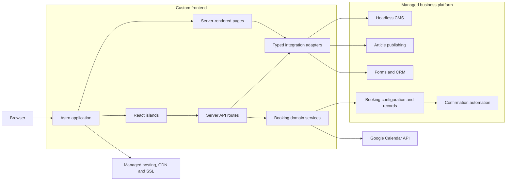
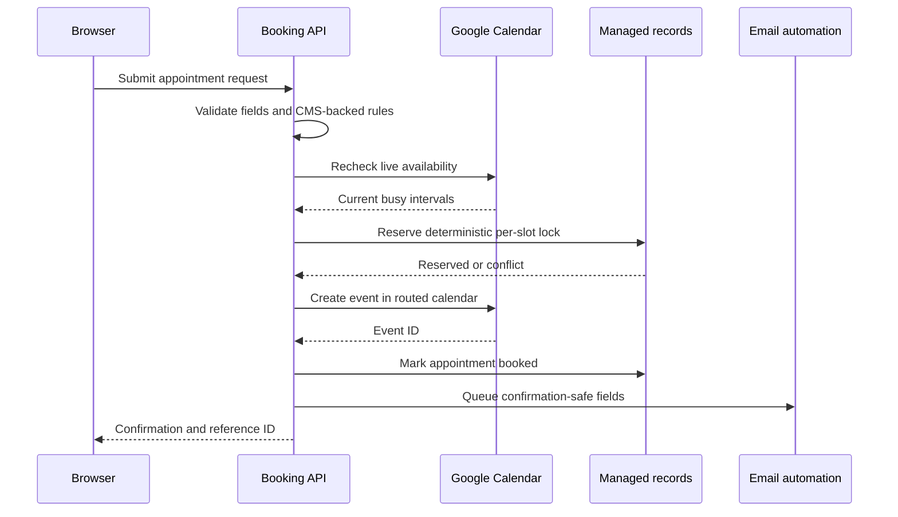

# Marin Holy Hill Acupuncture

A custom Astro + TypeScript production application combining a server-rendered frontend, headless business infrastructure, dynamic content management, and a direct Google Calendar appointment-booking system.

[](https://astro.build/)
[](https://react.dev/)
[](https://www.typescriptlang.org/)

[](https://developers.google.com/calendar/api)

**Production:** [marinholyhillacu.com](https://www.marinholyhillacu.com/)

## Overview

I rebuilt an existing healthcare clinic website as a custom-coded production application rather than using a visual page-builder frontend. The goal was to gain full control over the experience—design, responsive behavior, application logic, performance, SEO, and integrations—without forcing nontechnical clinic staff to adopt a developer-only content workflow.

The result is a hybrid headless architecture. Astro and TypeScript own the presentation layer and server logic, while a managed third-party business platform supplies content management, forms, contacts, article publishing, analytics, hosting, CDN, and SSL. Typed SDK and API adapters keep those services behind a stable application boundary.

The project also includes a custom multi-step booking experience. Availability is calculated from managed business rules and live Google Calendar data, then appointments are validated, concurrency-checked, written to the appropriate calendar, recorded for clinic operations, and followed by a confirmation email.

## Architecture



The application is configured for Astro server output. Pages fetch operational content on the server and return complete HTML, while JavaScript is reserved for the experiences that need client-side state: mobile navigation, the schema-driven contact form, the rich-content article viewer, and the booking wizard.

## System responsibilities

| Layer | Responsibility |
| --- | --- |
| Astro pages and layouts | Route composition, server rendering, metadata, structured data, and the shared site shell |
| Astro components | Reusable content sections, service and location cards, calls to action, and design-system primitives |
| React islands | Focused interactive workflows without turning the entire site into a client-rendered application |
| Typed domain models | Stable contracts for services, conditions, locations, pricing, articles, and booking configuration |
| Integration adapters | Convert third-party responses into application models and provide guarded fallback behavior |
| Server API routes | Validate and process contact and booking requests without exposing privileged integration logic |
| Managed business services | CMS, article publishing, forms, contacts, analytics, operational automation, and infrastructure |
| Google Calendar | Source of truth for busy time and the destination for confirmed appointment events |

## Frontend architecture

### Server rendering with selective hydration

Astro renders the content-heavy site on the server. React is used as an island architecture rather than as the page runtime:

- the booking wizard is loaded only on the booking route;
- the contact form hydrates with a server-projected form schema;
- published rich content is rendered through a dedicated viewer island; and
- the mobile navigation hydrates independently from the rest of the layout.

This keeps page structure, navigation, service content, and most visual components available as HTML before client JavaScript runs.

### Component and styling strategy

The UI is organized into layouts, reusable sections, and small interface primitives. Global design tokens define color, typography, spacing, radii, and responsive behavior; page and component styles stay close to the markup they support. Responsive image variants are generated ahead of time and served with explicit dimensions, `srcset`, and appropriate loading behavior.

### SEO and discovery

The application includes:

- canonical URLs, descriptions, Open Graph metadata, and social preview images;
- managed SEO metadata for published articles;
- JSON-LD for practitioner and medical-business entities;
- a dynamic sitemap containing application routes, CMS-driven services, and published articles; and
- semantic page structure, breadcrumbs, skip navigation, labeled controls, focus management, and accessible validation states.

## Headless content and publishing

Content and application code have deliberately separate lifecycles. Developers own route structure, components, integration logic, and presentation. Clinic staff can update structured business content and publish articles through a managed administrative system without editing source code or releasing a new frontend build.

The content layer covers:

- site and practitioner settings;
- services and condition groupings;
- clinic locations and hours;
- insurance and pricing information;
- approved testimonials;
- bookable services, closures, calendar routing, and booking rules; and
- long-form health articles with rich content and managed metadata.

Pages do not consume raw SDK responses directly. Integration adapters normalize external records into TypeScript domain models, apply publication and consent filters, sort display data, resolve managed media URLs, and return local fallbacks for essential public content when a read fails. Articles use a separate adapter because their publishing model, rich content, media, pagination, and SEO lifecycle differ from general CMS records.

## Custom booking implementation

The booking system was built around the clinic's existing Google Calendar workflow instead of introducing a second scheduling source of truth.

### Availability flow

1. The booking page loads active services, locations, slot rules, and cancellation text on the server.
2. The React wizard collects patient type, service, location, and date before requesting availability.
3. The availability route combines business hours, closure dates, lead time, maximum advance range, and the configured slot duration.
4. A fresh Google Calendar `freeBusy` request checks every calendar configured to count as busy.
5. The server returns only valid UTC slot starts and display-safe configuration to the browser.

All clinic-facing time is normalized to `America/Phoenix`, including user-facing labels and RFC 3339 values sent to Google Calendar.

### Appointment creation flow



The create endpoint does not trust a previously displayed slot. It validates the submitted service and location against current managed content, recomputes availability immediately before booking, and returns a conflict response if the slot has been taken.

To handle concurrent requests, the application derives a deterministic appointment identifier from the location and slot start using SHA-256. The resulting protected record acts as a per-slot lock: two submissions for the same appointment cannot both reserve it. Fresh in-progress locks are respected, while stale records from interrupted workflows can be recovered. If calendar event creation fails after reservation, the lock is released so the time becomes bookable again.

Patient type and service determine which operational calendar receives the event. The actual calendar identifiers remain managed data rather than source-code constants, preserving the clinic's established calendar organization while keeping routing logic testable and explicit.

Confirmation delivery is decoupled from the authoritative booking result. After a successful calendar write, the server stores a limited confirmation payload that triggers a managed email automation. A delivery failure does not incorrectly report that an already-created appointment failed.

## Forms, CRM, and analytics

The contact form is schema-driven. Its field definitions, labels, requirements, options, and validation constraints are loaded from the managed forms service, projected into a small frontend model, and rendered by a React island.

Submissions pass through an Astro server endpoint that:

- enforces a request-size limit;
- rejects unknown fields;
- validates the payload against the current server-side form schema;
- normalizes supported phone-number formats;
- maps service validation errors back to individual fields; and
- submits accepted data to managed forms and contact workflows.

Analytics use a fixed event vocabulary for page views, calls to action, booking actions, phone and directions clicks, and form outcomes. Events include the interaction and page section—not form contents or patient details—and can be consumed through browser custom events or an available data layer.

## Engineering decisions

| Decision | Why it matters |
| --- | --- |
| Custom frontend over a page-builder UI | Preserves control over responsive design, semantics, application logic, and integrations |
| Managed back office instead of a custom admin | Gives clinic staff familiar content, publishing, form, and contact-management workflows |
| Typed adapters between pages and services | Isolates vendor response shapes and gives UI code predictable domain objects |
| Server API routes for writes | Keeps privileged operations and integration credentials out of browser bundles |
| React only for interactive islands | Limits client JavaScript while retaining rich application workflows where needed |
| Live revalidation before booking | Prevents stale availability shown in the browser from being treated as authoritative |
| Deterministic per-slot locking | Provides an application-level concurrency guard against double booking |
| CMS-driven operational settings | Allows hours, closures, services, calendar mapping, and booking windows to change without frontend edits |
| Guarded reads with curated fallbacks | Keeps essential public pages usable during transient content-service failures |
| Managed article pipeline | Lets staff publish rich articles while the custom frontend controls discovery and presentation |

## Privacy and security

This application handles healthcare-adjacent contact and scheduling data, so its trust boundaries are intentionally explicit:

- Google Cloud service-account credentials and API access tokens remain server-only.
- Google OAuth access tokens are minted with signed JWT assertions using Web Crypto and cached only until shortly before expiry.
- Browser bundles receive display data and availability, never integration credentials or privileged SDK operations.
- Contact and booking payloads are size-limited and validated on the server; request bodies are not logged.
- Analytics events exclude names, contact details, messages, insurance information, dates of birth, and health information.
- Confirmation automation receives only the fields needed to deliver and identify the appointment; more sensitive booking fields remain in restricted operational systems.
- Public testimonials are returned only when both publication and consent flags are present.
- Secrets, local platform state, and service-account material are excluded from version control and are intentionally omitted from this documentation.

These safeguards describe the implemented data-handling strategy; they are not a claim of regulatory certification.

## Technology stack

| Area | Technology |
| --- | --- |
| Application framework | Astro 5, server output, file-based routing |
| Language | TypeScript with Astro's strict configuration |
| Interactive UI | React 18 islands |
| Presentation | Semantic HTML, component-scoped CSS, global design tokens, responsive images |
| Server layer | Astro API routes and server-side SDK/API calls |
| Content | Headless CMS, typed data adapters, managed media |
| Publishing | Managed article publishing, rich-content rendering, managed SEO metadata |
| Business workflows | Managed forms, submissions, contacts/CRM, analytics, and email automation |
| Scheduling | Google Calendar REST API: `freeBusy` and event creation |
| Authentication | Google Cloud service account, JWT bearer flow, Web Crypto |
| Infrastructure | Managed server runtime, hosting, CDN, and SSL |
| Tooling | npm scripts, managed platform CLI, Sharp-based image optimization |

## Repository structure

```text
src/
├── components/
│   ├── articles/        # Article cards and rich-content rendering
│   ├── booking/         # Multi-step React booking wizard
│   ├── forms/           # Schema-driven React contact form
│   ├── layout/          # Header, footer, metadata, breadcrumbs, JSON-LD
│   ├── sections/        # Reusable page-level content sections
│   └── ui/              # Design-system primitives
├── content/             # Curated fallback and static editorial content
├── layouts/             # Shared Astro document and site shell
├── lib/
│   ├── booking/         # Availability, locking, routing, time, confirmation
│   ├── google/          # Server-only Google auth and Calendar client
│   ├── analytics.ts     # No-PII interaction event vocabulary
│   ├── contact-form.ts  # Form-schema projection and validation
│   └── …                # Typed CMS and publishing adapters
├── pages/
│   ├── api/             # Contact and booking endpoints
│   ├── articles/        # Managed article listing and detail routes
│   ├── conditions/      # Condition index and category routes
│   └── services/        # Service index and dynamic detail routes
├── styles/              # Global styles and design tokens
└── types/               # Content and article domain models
```

## Local development

### Prerequisites

- Node.js 20.11 or newer
- npm
- Authorized access to the linked managed project for live CMS, forms, and article data
- Private runtime credentials supplied out of band for Google Calendar booking

Do not commit local environment files, service-account material, or generated platform state.

### Setup

```bash
git clone <repository-url>
cd holy-accupunture
npm install
npm run dev
```

The managed development command starts the local server with hot reload and the authenticated service context. A direct Astro development server is also available for frontend-focused work:

```bash
npm run start
```

### Validation commands

```bash
npm run build
npm run preview
```

`npm run build` exercises the production server adapter and is the primary compilation check. `npm run preview` serves the production build through the managed preview workflow. Production release access is intentionally separate from local setup.

## Project scope

This repository contains the custom application layer for a real clinic website: frontend composition, design system, server rendering, content adapters, form handling, booking logic, Calendar integration, SEO, analytics hooks, and managed-service integration. Day-to-day business content and operational records live in the connected managed services rather than in this public codebase.
