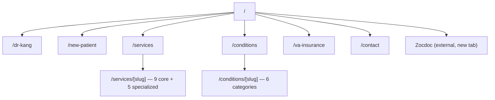

# Current Plan — Marin Holy Hill Acupuncture Redesign

**Written:** August 2, 2026
**Audience:** the coding agent that will build this. Read this file first, then `PROJECT_CONTEXT.md` (business requirements), `ARCHITECTURE.md` (how the system works), and `DEVELOPMENT.md` (workflow and Wix procedures).
**Status:** approved to build. Decisions in §2 are confirmed by the client and override earlier drafts.

This plan turns the working-but-unstyled Astro foundation into the complete redesigned website: a real design system, the client's revised eight-item navigation, every page built, all content loaded from the source documents, and one release at the end.

---

## 1. Verified starting state

All of the following was checked against the repository on August 2, 2026 and is accurate.

| Item | Value |
|---|---|
| `siteId` | `c68648ed-1577-4028-86b1-7312970b1945` |
| `appId` | `6b6784ba-48b1-47bb-8a5a-86ddb8545b2f` |
| Contact `formId` | `ef70c223-ff89-4a90-a784-9de20cc87b69` (in `src/lib/wix/config.ts`) |
| Form field targets | `first_name`, `last_name`, `email`, `phone`, `message` |
| CMS collections | `Treatments`, `Conditions`, `SiteSettings` (public-read) |
| Data boundary | `src/lib/wix/data.ts` |
| Domain types | `src/types/content.ts` |
| Live URL | `https://marin-holy-17907997-marinholyhillacu.wix-site-host.com` |
| Dashboard | `https://manage.wix.com/dashboard/c68648ed-1577-4028-86b1-7312970b1945` |
| Wix CLI login | `marinholyhillacu@gmail.com` (confirmed working) |
| Tooling available | `sharp`, Python 3.13 with PIL, `unzip` |

Existing pages: `src/pages/index.astro`, `src/pages/treatments/index.astro`, `src/pages/treatments/[slug].astro`, `src/pages/contact.astro`, `src/pages/api/contact.ts`. Styling is ~60 lines of inline CSS in `src/layouts/SiteLayout.astro`. All of it gets replaced or rewritten by this plan, but the **adapter pattern and guarded-fallback convention are kept**.

Do not run `init` or `headless link` again. This is a `managed` + `iterate` project.

### The old production site (untouched)

`https://www.marinholyhillacu.com/` is a separate Wix Studio project (`siteId 330eb101-1304-4048-a32a-07357d9b4b2b`). It stays live. Its full URL inventory, captured for the redirect map, is: `/`, `/bookingpage`, `/team`, `/beforeafter`, `/blank`, `/blank-1`, `/blank-2`.

---

## 2. Confirmed decisions (August 2, 2026)

| # | Decision | Detail |
|---|---|---|
| 1 | **Scope** | Full redesign: new design system plus every page in the revised navigation. |
| 2 | **`specs_v1.docx` is an approved content source** | Use it for body copy wherever `PROJECT_CONTEXT.md` and `specs_v2.docx` are silent (Home, the nine service write-ups, the specialized-care pages). All of it must be compliance-rewritten per §6. |
| 3 | **Specialized Care lives under Services** | The five v1 topics with no other home (Weight Loss, Constipation, Colds & Allergies, Fertility Support, Oncology Support) become a Specialized Care group inside Services, with their own pages. Facial Acupuncture and Auto Injury are already core services. |
| 4 | **Payson is "Opening soon"** | Show name, address, phone. No hours (none supplied — do not invent). Exclude from structured data until it opens. |
| 5 | **Navigation label is "Conditions"** | Not "Treats". Clearest for patients and best for search. |
| 6 | **Book goes to Zocdoc** | `https://www.zocdoc.com/practice/marin-holy-hill-acupuncture-clinic-175973?lock=true&isNewPatient=false&referrerType=widget` — see `PROJECT_CONTEXT.md` §5 for the implementation rules and the open question about the `isNewPatient` parameter. |
| 7 | **Testimonials are included** | The three already published on the live site (DZ, Devin L., Natasha Larson). Quote them verbatim; do not embellish. |
| 8 | **Images: use the existing pool as-is** | `public/images/source-document/` is approved by the client. The two photos embedded in `specs_v2.docx` are the same photos at lower resolution, so the pool's copies are preferred and nothing new needs extracting. |

---

## 3. Design direction

The brand name is the design thesis. **Holy Hill** — and the hero photo the client supplied is Dr. Kang meditating on a ridge at sunrise. Build the identity from that rather than from generic wellness styling.

### Tokens

Define these in `src/styles/tokens.css` and derive every color and type decision from them.

```
--ink:        #1B211F   /* pine-black, body text */
--pine:       #24463C   /* primary brand: header, buttons, headings */
--pine-deep:  #16302A   /* hover, footer */
--ridge:      #64798A   /* dusk slate: secondary surfaces, muted text */
--dawn:       #E0873A   /* amber accent: CTAs and eyebrows ONLY */
--dawn-pale:  #F7DFB8   /* accent wash */
--paper:      #F1F2ED   /* page background: cool mist, NOT warm cream */
--surface:    #FFFFFF   /* cards */
--line:       #DCDFD8   /* hairlines */
```

The base is deliberately cooled toward the photo's mountain haze rather than the warm cream (`#F4F1EA`) that reads as a templated default. Amber is rationed to actions and eyebrows — if it starts appearing in body text or backgrounds, pull it back.

### Type

Self-host with `@fontsource` packages, `font-display: swap`.

- **Display: `Gowun Batang`** — a Korean myeongjo serif. Chosen because Dr. Kang is a third-generation Korean practitioner; it carries that lineage instead of defaulting to a Western high-contrast serif. Use with restraint: page titles, section headings, pull quotes.
- **Body: `IBM Plex Sans`** — clinical, legible, trustworthy.
- **Utility: `IBM Plex Mono`** — prices, hours, phase labels, small caps eyebrows.

Set an explicit scale (suggest 1.25 ratio) with intentional weights. Do not let the display face leak into UI controls.

### Signature element

A **layered ridgeline**: a two-tone SVG ridge silhouette over a dawn gradient. It anchors the hero and recurs as a hairline ridge at major section transitions. This is the one bold move — keep everything around it quiet and disciplined. Build it as `src/components/ui/RidgelineDivider.astro` with a variant for the hero and a subtle variant for section breaks.

### Structure and motion

- Numbered markers **only** where content is genuinely sequential: the six first-visit steps and the three healing phases. Nowhere else.
- One orchestrated hero reveal, plus hover states. Respect `prefers-reduced-motion`.
- No animation libraries.

### Components to build

`src/components/ui/`: `Button.astro` (primary/secondary/ghost), `Card.astro`, `Section.astro`, `Eyebrow.astro`, `RidgelineDivider.astro`, `Badge.astro`, `Prose.astro` (wraps `set:html` rich text with typographic styles).

`src/components/sections/`: `Hero.astro`, `TrustStrip.astro`, `ServiceGrid.astro`, `ConditionCategoryGrid.astro`, `ProcessSteps.astro`, `PhaseTimeline.astro`, `TestimonialRow.astro`, `LocationCard.astro`, `InsuranceGrid.astro`, `PricingTable.astro`, `CtaBand.astro`.

`src/components/layout/`: `Header.astro`, `MobileNav` (the only React island besides the form), `Footer.astro`, `SeoHead.astro`, `JsonLd.astro`, `Breadcrumbs.astro`.

Watch CSS specificity between `.section` type selectors and element-level rules — that is where section padding conflicts appear.

---

## 4. Information architecture and routes

Primary navigation: **Home · Dr. Kang · New Patient · Services · Conditions · VA & Insurance · Contact**, plus a persistent **Book** button (external, Zocdoc).



| Route | Source | Notes |
|---|---|---|
| `/` | `src/content/home.ts` + CMS | Ten-section sequence, `PROJECT_CONTEXT.md` §7.1 |
| `/dr-kang` | `src/content/dr-kang.ts` | Three sections: Meet, Why Choose, Chronic & Complex |
| `/new-patient` | `src/content/new-patient.ts` | First visit, treatment plan, aftercare guide |
| `/services` | CMS `Treatments` | Core group, then Specialized Care group |
| `/services/[slug]` | CMS `Treatments` | One template, 14 rows |
| `/conditions` | CMS `Conditions` + category map | Grouped by category |
| `/conditions/[slug]` | category map + CMS | 6 category pages |
| `/va-insurance` | CMS `InsuranceProviders`, `Pricing` | VA, coverage, pricing |
| `/contact` | CMS `Locations` + Wix Forms | Two location cards, form |
| `/sitemap.xml`, `/robots.txt` | generated | Server routes |

**Route move:** `/treatments/*` becomes `/services/*` to match the navigation. Keep the CMS collection id `Treatments` — renaming a Wix collection id is disruptive and gains nothing. Nothing public links to `/treatments` yet, so no redirect is needed.

**No thin condition pages.** Individual conditions are listed inside their category page, not given their own routes. The document supplies no per-condition copy for most of them, and empty detail pages hurt both patients and search.

### Slugs

Core services: `acupuncture`, `electro-acupuncture`, `facial-acupuncture`, `ear-acupuncture`, `moxibustion`, `medical-massage-met`, `lymphatic-massage`, `herbal-medicine`, `auto-injury-care`.

Specialized care: `colds-and-allergies`, `weight-loss-support`, `constipation-support`, `fertility-support`, `oncology-support`.

Condition categories: `pain-and-injury`, `mental-and-emotional`, `immune-and-respiratory`, `energy-and-digestive`, `womens-health`, `skin-and-facial`.

---

## 5. Content sources and where each page's copy comes from

Precedence: the user's latest instruction, then `PROJECT_CONTEXT.md`, then `specs_v2.docx`, then `specs_v1.docx`, then the live site. Never invent medical, pricing, insurance, or credential facts.

Extract the source text once so copy is traceable. Write it to `agent-context/source-text/specs_v1.md` and `specs_v2.md` using:

```bash
cd agent-context && PYTHONIOENCODING=utf-8 python -c "
import zipfile,re
z=zipfile.ZipFile('specs_v1.docx')
x=z.read('word/document.xml').decode('utf8')
for i,p in enumerate(re.findall(r'<w:p[ >].*?</w:p>',x,re.S)):
    t=''.join(re.findall(r'<w:t[^>]*>(.*?)</w:t>',p,re.S)).replace('&amp;','&').strip()
    if t: print(i,'|',t)
" > source-text/specs_v1.md
```

`specs_v1.docx` paragraph map (1035 paragraphs, 118k characters):

| Content | Paragraphs |
|---|---|
| Home: slogans, trust points, service blurbs | 100–307 |
| Who We Are, Our Care, Our Promise | 308–336 |
| Why Choose Us | 337–359 |
| Meet Dr. Kang | 360–368 |
| New Patient: first visit | 370–405 |
| Treatment plan, three phases | 406–430 |
| Post-treatment wellness guide | 431–477 |
| Acupuncture | 485–505 |
| Cupping | 506–517 |
| Medical Massage / MET | 518–535 |
| Moxibustion | 536–554 |
| Herbal Medicine | 555–574 |
| Condition categories (We Treat) | 585–628 |
| Facial Acupuncture | 630–663 |
| Motor Vehicle Injury | 664–689 |
| Colds & Allergies | 690–722 |
| Weight Loss | 723–747 |
| Constipation | 748–776 |
| Fertility Support | 777–820 |
| Oncology | 821–845 |
| Stress & Headache | 847–864 |
| Insomnia | 865–882 |
| Condition headings with no copy (#32–#51) | 883–908 |
| Insurance | 910–955 |
| Pricing | 956–1001 |
| Contact | 1002–1035 |

`specs_v2.docx` (242 paragraphs) is the newer, authoritative source for: Dr. Kang page (paras 30–44), New Patient (46–145), VA & Insurance (152–177), Pricing (198–237). Where v1 and v2 cover the same ground, **v2 wins**.

Conditions #32–#51 in v1 are headings only. Do not generate copy for them.

---

## 6. Compliance rules — read before writing any copy

Every medical, insurance, pricing, and promotional line is **draft until Dr. Kang approves it**. Maintain `agent-context/CONTENT_REVIEW.md` as you build: one row per page, recording the source paragraph, the published wording, and any claim that was softened or dropped. This is the artifact the client signs off on.

Rewrite, never publish, claims equivalent to: cure or permanent resolution, guaranteed root-cause healing, instant relief, zero side effects, repairing nerve pathways, detoxifying the body, preventing recurrence, or treating cancer, Parkinson's, infertility, autoimmune or mental illness as a replacement for medical care.

Specific lines in the sources that **must** be rewritten:

- v2: "He has the ability to diagnose unseen internal illnesses within the body." → describe pulse diagnosis and palpation as assessment methods, not clairvoyance.
- v2: "prevent the recurrence of chronic issues" → "support long-term wellbeing".
- v2 cupping aftercare: marks are "signs of toxin release" → describe them as a normal temporary local response.
- v1 fertility: any claim that acupuncture "significantly increases IVF success" → framed as supportive care alongside a fertility specialist's treatment.
- v1 oncology: must read as supportive care for comfort and quality of life alongside oncology treatment, never as cancer treatment.

Use "may support", "is commonly used to help manage", "can be part of an integrative care plan". Every specialized-care and condition page carries a short disclaimer and a line encouraging appropriate medical evaluation. The site-wide medical disclaimer stays in `SiteSettings.medicalDisclaimer`, rendered in the footer.

Faith stays visible but welcoming: prayer before diagnosis and treatment is part of who Dr. Kang is (`PROJECT_CONTEXT.md` §6). Do not phrase it as a divine guarantee of healing.

---

## 7. Data model changes

Follow `DEVELOPMENT.md` §4b/§4c and the recipe at `.agents/skills/wix-headless/references/inline-recipes/setup-cms.md`. Every new collection needs an explicit `permissions` block with `read: "ANYONE"` and admin writes. Extend `scripts/wix-seed.mjs` rather than writing a parallel script.

### `Treatments` (extend)

Add fields: `serviceGroup` (`core` | `specialized`), `howItWorks` (RICH_TEXT), `indications` (RICH_TEXT), `imagePath` (text), `seoTitle`, `seoDescription`. Seed 14 rows using the slugs in §4.

Set the three existing placeholder rows to `published: false` rather than deleting them, and **add a `published` filter to the adapters** — `getTreatments()` currently returns everything.

### `Conditions` (extend)

Seed the individual conditions from `PROJECT_CONTEXT.md` §7.5 with their `category` set to a category slug from §4. Copy exists only for Stress & Headache and Insomnia (v1 paras 847–882); every other row gets a factual one-line `summary` and no `description`. Retire the three placeholder rows the same way.

Category titles, intros, and ordering live in `src/content/condition-categories.ts` — that is page structure, not business data. Adding a new category is therefore a code change; note this for the client.

### `Locations` (new)

Fields: `name`, `slug`, `addressLine1`, `addressLine2`, `city`, `state`, `postalCode`, `phone`, `email`, `weekdayHours`, `saturdayHours`, `sundayHours`, `mapUrl`, `directionsUrl`, `status` (`open` | `opening_soon`), `displayOrder`, `active`.

Seed Mesa (`open`, with hours) and Payson (`opening_soon`, phone and address only, no hours). Build `mapUrl` and `directionsUrl` deterministically from the address as Google Maps links — no API key required:

- Map: `https://www.google.com/maps/search/?api=1&query=<url-encoded address>`
- Directions: `https://www.google.com/maps/dir/?api=1&destination=<url-encoded address>`

`SiteSettings` keeps business-wide values (`businessName`, `doctorName`, `bookingUrl`, `medicalDisclaimer`, public email) and **loses** the single-location address/phone/hours once `Locations` is live. Keep the fields until the migration is done so nothing breaks mid-build.

### `InsuranceProviders`, `Pricing`, `Testimonials` (new)

- `InsuranceProviders`: `providerName`, `coverageNote`, `networkStatus`, `displayOrder`, `active`, `verifiedDate`.
- `Pricing`: `serviceName`, `category`, `price`, `priceNote`, `displayOrder`, `active`. Seed the ten line items from `PROJECT_CONTEXT.md` §7.6.
- `Testimonials`: `patientDisplayName`, `quote`, `sourceNote`, `consentConfirmed`, `displayOrder`, `published`. Seed the three from the live site with `sourceNote` recording that they were already published there.

### Adapters and types

Extend `src/types/content.ts` and `src/lib/wix/data.ts` with `Location`, `InsuranceProvider`, `PricingItem`, `Testimonial`, and the new `Treatment` fields. Every adapter keeps the existing shape: `try/catch`, a typed fallback, a `console.error` that logs no PII. Add `getLocations()`, `getInsuranceProviders()`, `getPricing()`, `getTestimonials()`, `getServiceBySlug()`, `getConditionsByCategory()`.

---

## 8. Images

The client approved `public/images/source-document/` as-is. Two problems must still be solved: total weight is 33 MB with single files up to 2.5 MB, and several images have text baked into them.

Write `scripts/optimize-images.mjs` using `sharp` to emit responsive WebP at 800 px and 1600 px into `public/images/site/`, preserving aspect ratio. Reference the optimized files everywhere with explicit `width`/`height`, `loading="lazy"` (except the hero, which is eager), `decoding="async"`, and descriptive alt text. Keep the originals in place as the archive.

Slug-to-image mapping goes in `src/lib/images.ts`, with the CMS `imagePath` field able to override it so owner-added rows can carry their own image.

| Page / section | File |
|---|---|
| Home hero | `home-hero-meditation-sunrise.png` |
| Home Dr. Kang preview | `dr-kang-headshot.png` |
| Home why-choose | `why-choose-us-family.png` |
| Dr. Kang — Meet | `dr-kang-acupuncture-profile.png` |
| Dr. Kang — Why Choose | `why-choose-us-family.png` |
| Dr. Kang — Chronic & Complex | `dr-kang-acupuncture-about.png` |
| New Patient — consultation | `tcm-formula-consultation.png` |
| New Patient — first treatment | `dr-kang-acupuncture-home.png` |
| Acupuncture | `acupuncture-neck-treatment.png` |
| Electro-acupuncture | `electro-acupuncture-treatment.png` |
| Facial acupuncture | `facial-acupuncture-specialty.png` |
| Ear acupuncture | `auricular-acupuncture-ear.jpeg` |
| Moxibustion | `moxibustion-therapy-back.png`, `moxibustion-therapy-closeup.png` |
| Medical massage / MET | `medical-massage-met-treatment.png` |
| Lymphatic massage | `lymphatic-massage-treatment.png` |
| Herbal medicine | `herbal-medicine-ingredients.png`, `personalized-herbal-prescriptions.png`, `family-herbal-formula.png` |
| Auto injury care | `therapeutic-massage-treatment.png` |
| Colds & allergies | `cold-and-allergies.png` |
| Weight loss | `weight-loss-support.png` |
| Constipation | `constipation-support.png` |
| Fertility support | `fertility-support.png` |
| Oncology support | `oncology-acupuncture-support.png` |
| Also-available services | `cupping-therapy-back.png`, `facial-healing-acupressure-treatment.png`, `medical-foot-therapy-treatment.png` |

**Do not use:** the seven `book-now-button-*.png` files and `insurance-section-heading.png` (text baked into images — recreate as real buttons and headings, per `PROJECT_CONTEXT.md` §9), `motor-vehicle-accident-care.png` (promotional text baked in), `facial-acupuncture-before-after.png` (unverified before/after), and the four social icons (no profile URLs supplied).

Several approved images carry a small baked-in topic label. They are cleared for use, but do not repeat the label in the adjacent heading, and note them in `CONTENT_REVIEW.md` as a cosmetic item to revisit when real photography arrives.

Optional, low priority: the live site's gallery has genuine clinic interior photos (front office, welcome desk, three healing rooms). Pulling those in would strengthen the locations section with real photography.

---

## 9. Page specifications

### `/` Home

Ten sections per `PROJECT_CONTEXT.md` §7.1: ridgeline hero with clinic identity, a concise benefit line, primary Book CTA and secondary call/contact CTA; trust strip (third generation, 28 years, personalized care, Mesa and Payson); Meet Dr. Kang preview; featured services (live query on `featured`, never a hardcoded slug list); conditions overview by category; why choose Dr. Kang; new-patient process preview; VA and insurance preview; both locations with phone and map links; final CTA band. Testimonials sit between the why-choose and new-patient sections.

### `/dr-kang`

Three sections: **Meet Dr. Hyo-won Kang** (biography from v2 paras 30–33 — education, family tradition, pulse diagnosis and palpation, prayer, humility), **Why Choose Dr. Kang** (v2 paras 35–37, with the clairvoyance claim rewritten), **Chronic & Complex Diseases** (v2 paras 39–44, framed as supportive integrative care that complements medical treatment). In-page anchor navigation, since it is one long page.

### `/new-patient`

**Your first visit** as six numbered steps (v2 paras 47–71) with the preparation tips. **Treatment plan** with the three phases as a `PhaseTimeline` (v2 paras 82–98), timelines labeled as guidance rather than promises. **Post-treatment wellness guide** (v2 paras 100–145): the dos and don'ts pair, then per-treatment aftercare, then "when to contact us". Anchor navigation across the three sections.

### `/services` and `/services/[slug]`

Index shows the nine core services, then the Specialized Care group, then an "also available" list for Cupping, Facial Acupressure, and Foot Reflexology (priced but not full services — see §11). Detail template renders hero image, description, how it works, what it may help with, related conditions, price and duration if present, and a Book CTA. Specialized-care pages additionally render a disclaimer block.

### `/conditions` and `/conditions/[slug]`

Index lists the six categories with their conditions as links to the category page. Category pages open with the category intro, list every condition in that category, name the treatments commonly used, and close with a supportive-care disclaimer plus a CTA. Stress & Headache and Insomnia get expanded write-ups inside their category page.

### `/va-insurance`

VA section first — it is the strongest trust element. Then in-network providers from CMS, specialized coverage (motor vehicle, VA prior authorization, workers' compensation), HSA/FSA, out-of-network superbills, and travel insurance. Every payer block carries the "coverage depends on your individual plan — please confirm with your insurer" note. Then the pricing table from CMS, with the January 1 effective-date note. UMR is listed as welcomed and must **not** be shown as in-network. See §11 for the network-status flag.

### `/contact`

Two `LocationCard`s: Mesa (full details, hours) and Payson (address, phone, "Opening soon", no hours). Each with click-to-call, map link, and directions link. Then the Wix-backed form with the privacy warning "Please do not include private medical details or sensitive health information in this form." Book and click-to-call as alternatives. No social icons.

---

## 10. Cross-cutting work

**Contact form.** Add real server-side validation to `src/pages/api/contact.ts` — it currently forwards to Wix and only maps Wix's errors back, which does not satisfy `PROJECT_CONTEXT.md` §10. Validate required fields, email format, and length limits before calling Wix; keep the existing field-violation mapping; keep never logging the request body. Mirror the rules client-side in `ContactForm.tsx` with an error summary. Continue reading the schema live from Wix.

**SEO.** Per-page title, description, canonical, and Open Graph via `SeoHead.astro`. Breadcrumbs on all detail pages. `sitemap.xml` and `robots.txt` as server routes. JSON-LD: `LocalBusiness` for Mesa only, plus `Person` for Dr. Kang. Do not put ratings, insurance, or credentials into structured data until §11 is resolved. Record the old-URL redirect map from §1 in `agent-context/REDIRECTS.md`; it cannot be activated until the domain points at this project.

**Accessibility.** Semantic landmarks, correct heading order, keyboard-accessible mobile nav with focus trapping, visible focus rings, contrast checked against the tokens, labeled form fields with an error summary, 44 px touch targets, reduced-motion support, meaningful alt text.

**Performance.** Astro components for everything static. Only two React islands: mobile nav and the contact form. Optimized WebP with dimensions. Self-hosted fonts. No third-party scripts.

**Analytics.** `src/lib/analytics.ts` with a no-PII event map: page view, CTA click, booking click, phone click, directions click, form start, form success, form failure. Events carry only the originating section — never a name, email, phone, message, symptom, or appointment detail. Verify on the deployed site, not locally.

**Documentation.** Fix the three stale cross-references to the deleted `MARIN_HOLY_HILL_PROJECT_CONTEXT.md`: `ARCHITECTURE.md` line 7, `DEVELOPMENT.md` line 9, and `scripts/wix-seed.mjs` line 10 — all should point to `PROJECT_CONTEXT.md`. Update `ARCHITECTURE.md` §6 and §9 with the new routes, collections, and current status when the build lands.

---

## 11. Open questions and the default to use until answered

Do not block on these. Implement the default, and record the item in `CONTENT_REVIEW.md` so the client can correct it in one place.

| Question | Default to build |
|---|---|
| Years of experience: context and v2 say 28, live site says "more than 30" | Use **28 years**, from `SiteSettings`. |
| Display name: "Dr. Hyo-won Kang" vs live site's "Dr. Henry Kang" | Use **Dr. Hyo-won Kang**, from `SiteSettings.doctorName`. |
| Credentials: context says he "pursued" a DAOM; the live site advertises "L.Ac, Ph.D., DAOM" | Describe education factually — Master's in Oriental Medicine (Samra), doctoral studies in Acupuncture and Oriental Medicine (South Baylor). **Do not print "Ph.D." or a "DAOM" postnominal** until confirmed. This is a licensing and advertising claim; flag it prominently. |
| Mesa hours still current? | Use the draft hours (Mon–Fri 8:30–6:00, Sat 9:00–4:00, Sun closed) from `Locations`. |
| Payson email and opening timeframe | Show "Opening soon" with no date; use the Mesa public email. |
| Are Cupping, Facial Acupressure, and Foot Reflexology services or just prices? | Pricing line items plus an "also available" mention on the Services index. No dedicated pages. Cupping is additionally described inside the relevant service and aftercare content. |
| "Three flexible payment methods" but only two listed | List only pay-per-visit and package plans. Do not print the word "three". Note that package pricing is not supplied. |
| Is VA provider status and the seven-payer in-network list verified? | Gate the words "in-network" behind a single constant, `INSURANCE_NETWORK_VERIFIED = false`. While false, render the list under "Insurance we work with" with the verify-your-benefits note. Keep the VA provider statement, which is the clinic's own statement about itself, with the prior-authorization note. |
| May the placeholder CMS rows be deleted? | Do not delete. Set `published: false` and filter in the adapters. |
| May a real test submission be sent to Wix Forms? | Do not send one. Leave it as a documented manual QA step for the client. |
| Privacy policy, medical disclaimer, cancellation and payment policy text | No legal pages and no footer legal links. The footer shows only `SiteSettings.medicalDisclaimer`. |
| Embedded Google Map | Link-out map and directions buttons — an embedded iframe now requires a paid API key. |
| Zocdoc `isNewPatient=false` parameter | Use the URL exactly as supplied. See the `TODO` in `PROJECT_CONTEXT.md` §5. |

---

## 12. Build order

1. Extract source text to `agent-context/source-text/`; start `CONTENT_REVIEW.md`.
2. Image optimization script; `src/lib/images.ts`.
3. Design tokens, fonts, global base, UI primitives.
4. Layout shell: `SeoHead`, `Header` with mobile nav, `Footer`, `JsonLd`, `Breadcrumbs`.
5. CMS: extend `Treatments`, `Conditions`, `SiteSettings`; create `Locations`, `InsuranceProviders`, `Pricing`, `Testimonials`; seed everything; add types and adapters.
6. `/services` index and detail (14 rows) — this proves the CMS template end to end.
7. `/conditions` index and six category pages.
8. `/dr-kang`.
9. `/new-patient`.
10. `/va-insurance`.
11. `/contact` with both locations, plus the form hardening in §10.
12. `/` Home, last, once every section component exists.
13. `sitemap.xml`, `robots.txt`, analytics, `REDIRECTS.md`.
14. Accessibility, contrast, responsive, and image-weight passes.
15. `npm run build`, fix everything it surfaces, then `npm run release` **once**.
16. Update `ARCHITECTURE.md` and `PROJECT_CONTEXT.md` with the final routes, collection ids, and status.

Release publishes only to the Wix host URL. `marinholyhillacu.com` is a different project and is not affected.

---

## 13. Definition of done

- [ ] Navigation is Home, Dr. Kang, New Patient, Services, Conditions, VA & Insurance, Contact, plus a Book button opening Zocdoc in a new tab.
- [ ] All routes in §4 render, are responsive from 320 px up, and have unique titles and descriptions.
- [ ] Mesa and Payson both appear with correct phone, address, map, and directions behavior; Payson shows "Opening soon" and no invented hours.
- [ ] Service and condition pages read through typed CMS adapters with guarded fallbacks; no hardcoded curation lists.
- [ ] Every SDK call degrades gracefully; empty and error states render.
- [ ] Contact form validates client-side and server-side, shows an error summary, carries the privacy warning, and logs no request bodies.
- [ ] No claim from §6 appears in published copy; every page is logged in `CONTENT_REVIEW.md`.
- [ ] Images are optimized WebP with dimensions and alt text; no baked-text button images are used.
- [ ] Keyboard navigation, focus states, heading order, and contrast all check out.
- [ ] No secrets, PII, or health data in the client bundle, logs, or analytics.
- [ ] `npm run build` clean; released once; live URL spot-checked.
- [ ] Docs updated and stale cross-references fixed.
